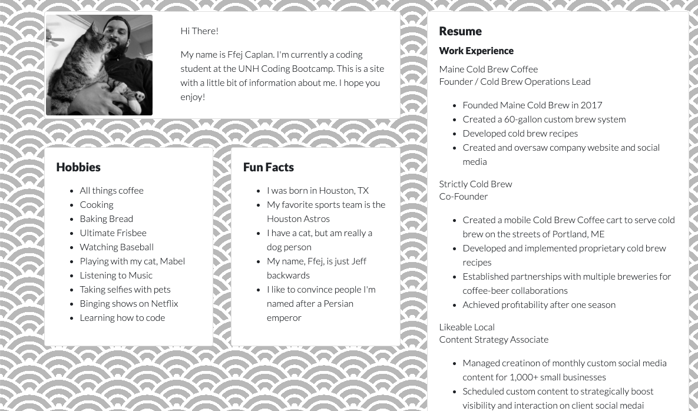

# 02_HW
## The assignment
The assignment was to create a webpage with a responsive bootstrap CSS framework. Other than a few parameters, there was a fair amount of wiggle-room in terms of content and structure, which meant that I got to get a little bit creative with it. I figured that it would be a good opportunity to figure out how to build a few HTML and CSS elements that could be useful in the future, namely a photo gallery and a resume. 

## Blank Canvas
Unlike the previous assignment, where we refractored an existing page, this one began with a blank canvas. The assignment called for me to create three pages (a home page, a gallery page, and a contact page). I also had to include links to my social media accounts. 

## Home Page
The home page is where I included the "about me" info. I felt that this was a good opportunity to work on my grids, subgrids, and div positioning. Before I started, I drew a rough draft on a piece of paper. I knew that I wanted a little intro box with a photo of me and a little greeting. Under that, I wanted two boxes, one for a unordered list of hobbies and another for an unordered list of fun facts. To the right I wanted a larger box that had my resume in it. The trickiest part of this was getting the hobbies and fun facts to be the same height. 
For the resume formatting, I had to figure out how I wanted to layout the information (company, job title, job description). I decided to use different header sizes. I also opted to use h6s and h7s with my own CSS so that I could remove the bottom margin. This helped to provide a bit more flow and natural grouping. I think it came out really nicely

## Gallery
For the gallery, I knew that I wanted it to be a grid of photos of me and pets. The cat is my cat, Mabel. The dog is my brother's dog, Leo. This came together pretty quickly. 

## Contact
I wasn't 100% if the contact info page should have my contact info or not. I decided that I'd rather go with a contact submission form. I found a form on bootstrap that had a nice layout. The boostrap form included fields for address (city, state, etc.), which I felt was unnecessary. It also used a few different formatting variations for labeling the text fields. Some of the text boxes had labels above the box, others had text in the box that disappeared when you clicked the field. I decided to switch all labels to be positioned about the text boxes. I thought it looked better and it helped to provide natural spacing. I also added a box for comments. For this to be functional, I would need to add some java that would submit this form to me in an email. I get enough emails as is, and didn't feel this was necessary to complete the assignment. 

## Footer
I decided for the social media accounts, I wanted to have the links on a footer that would be present on all three pages. Hardest part of the footer was getting the social media icons to size. Since every other photo I had used a bootstrap class, I decided it was safe to alter the  tag in my css doc to establlish a standard thumbnail size. I think it came out nicely. 
